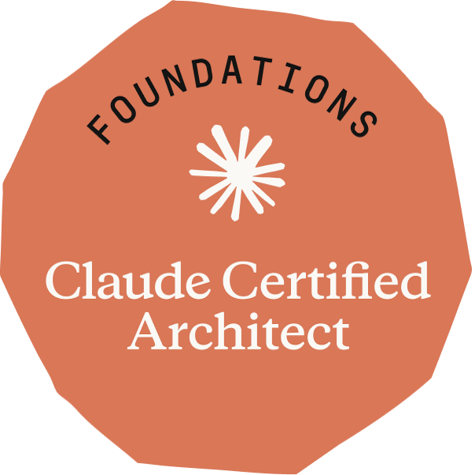

# Claude Certified Architect — Foundations (CCAR-F) Study Repo

Open study materials for Anthropic's **Claude Certified Architect – Foundations** certification: a domain-by-domain written guide, a 28-day study plan, cheat sheets, flashcards, and a **free interactive practice exam** with scaled scoring and a personalized review plan.

> **Not affiliated with or endorsed by Anthropic.** This is independent, community-built study material. Exam names are Anthropic trademarks. Always verify logistics against the official exam guide and certification pages before scheduling.

## ✅ Passed: 940 / 1,000

I sat the exam on **18 September 2026** (proctored) and passed with a scaled score of **940** (passing score: 720). I used this repo's materials to prepare, then strengthened them afterwards — see [what changed](#-updated-after-the-exam).

**Score: 940 / 1,000** · passing score 720 · result: **Pass**  
**[Verify my credential on Credly →](https://www.credly.com/badges/4bebefca-9f6c-4465-a344-07eeaf973646/public_url)**  
Credential: [Claude Certified Architect – Foundations](https://www.credly.com/org/anthropic/badge/claude-certified-architect-foundations) (badge artwork © Anthropic, shown here to identify the credential I earned).

## 🚀 Start here

| Resource | What it is |
|---|---|
| **[Interactive practice exam](https://aloaguilar20.github.io/claude-certified-architect-foundations-prep/practice-exam.html)** | 71 scenario-anchored questions · study / timed-simulation / quick-drill modes · scaled 100–1,000 scoring at the 720 line · generates a ranked review plan |
| **[Interactive study reader](https://aloaguilar20.github.io/claude-certified-architect-foundations-prep/study-guide.html)** | The full guide as a day-by-day reader with progress tracking, deep-linked from every exam question |
| [Exam guide & strategy](guide/00-exam-guide.md) | Format, scoring, retakes, the six scenarios, and a 5-step method for scenario questions |
| [Domain 1 — Agentic Architecture & Orchestration (27%)](guide/01-agentic-architecture.md) | The agentic loop, subagents, hooks, decomposition, sessions |
| [Domain 2 — Tool Design & MCP Integration (18%)](guide/02-tool-design-mcp.md) | Tool descriptions, `tool_choice`, MCP servers, structured errors |
| [Domain 3 — Claude Code Configuration & Workflows (20%)](guide/03-claude-code.md) | CLAUDE.md, rules, skills, plan mode, built-in tools, CI/CD |
| [Domain 4 — Prompt Engineering & Structured Output (20%)](guide/04-prompt-engineering.md) | JSON schemas, few-shot, explicit criteria, validation & retry |
| [Domain 5 — Context Management & Reliability (15%)](guide/05-context-reliability.md) | Error handling, escalation, context strategies, provenance, batches |
| [28-day study plan](guide/study-plan.md) | A four-week schedule through all of the above |
| **[Interactive flashcards](https://aloaguilar20.github.io/claude-certified-architect-foundations-prep/flashcards.html)** | 72 self-grading cards by domain · missed cards build a persistent review pile · deep-linked from exam results ([markdown source](cheatsheets/flashcards.md)) |
| **[Interactive cheat sheet](https://aloaguilar20.github.io/claude-certified-architect-foundations-prep/cheat-sheet.html)** | One block per domain + the 5-step scenario method, print-friendly ([markdown source](cheatsheets/cheat-sheet.md)) |

> **About the practice-exam questions:** all 71 items are AI-generated. The first 51 were written with Claude Fable 5 from the official exam guide's published domains and scenario contexts; the 20 added after the exam were written with Claude Sonnet 5 and checked against the current official docs. They are original practice questions written to test your understanding of the material — **not real exam questions**, not derived from the actual item bank, and not predictive of the specific questions you will face.

## 🔄 Updated after the exam

After passing, I went back over this kit and strengthened the topics that matter most in day-to-day Claude Code and agent work. No exam items or exam-guide text were copied — everything below is written from the public documentation:

- **+20 practice questions** (now 71) on subagent coordination, codebase exploration (Glob vs Grep vs Read, token-efficient search), test generation and iteration, CI review configuration, PR merge gates, and MCP scopes.
- **New guide sections:** *Managing subagents well* (Domain 1), *Built-in tools and codebase exploration* and *Configuring an automated review / Testing strategies / PR merging* (Domain 3), MCP scopes and verification (Domain 2).
- **+21 flashcards** (now 72) and new cheat-sheet reflexes for each of these.
- **Correction:** the Batch API's only commitment is completion within 24 hours; many batches finish sooner, but nothing is guaranteed.

## 📋 Exam at a glance

| Item | Detail |
|---|---|
| Exam code | **CCAR-F** on Pearson VUE (formerly CCA-F on the original platform — same content) |
| Format | 60 items, 120 minutes; 4 scenarios drawn at random from a published set of 6 |
| Question types | Multiple choice and multiple response |
| Scoring | Scaled 100–1,000; **720 to pass** (scaled — 720 ≠ 72% correct) |
| Retakes | 14 days after a 1st failure, 30 after a 2nd, 90 after a 3rd; four attempts per rolling 12 months |
| Validity | 12 months |
| Access | Partner-only: your **organization** must be a member of the [Claude Partner Network](https://claude.com/partners) and register you in the Partner Academy; exams are scheduled through Pearson VUE. Not open individual enrollment |
| Official exam guide | Not publicly hosted — available inside the Anthropic Partner Academy to registered practitioners of member organizations. If you have access, get it and read it: it is the authoritative source this kit is checked against |

**Domain weightings:** D1 Agentic Architecture 27% · D2 Tools/MCP 18% · D3 Claude Code 20% · D4 Prompt Engineering/Structured Output 20% · D5 Context/Reliability 15%.

*Logistics change; verify on the official certification page before you book.*

## 🔍 How this differs from other study repos

The best-known community resource is [paullarionov/claude-certified-architect](https://github.com/paullarionov/claude-certified-architect) — genuinely excellent, with guides in 11 languages, and the original inspiration for this project's topic sequencing. This repo is complementary, with a different focus:

- **Current logistics.** Written for the exam as delivered *today*: CCAR-F on Pearson VUE, scaled 100–1,000 scoring at the 720 line, multiple-response items, current retake rules — where older materials still describe the original Skilljar-era launch.
- **Verified against today's official docs, cited per topic.** Every chapter links its primary sources, and drift is flagged explicitly (e.g. the four-hop import limit, `pause_turn`, `tool_choice: none`, current model IDs, batch-API tool support).
- **An exam-strategy layer, not just content:** a 5-step method for scenario questions, distractor analysis (when a hook is *not* the answer), timing tactics, and a readiness checklist.
- **A complete study system:** 28-day plan with checkpoints and a week-4 diagnose→repair→retest loop, per-domain cheat sheet, and flashcards.
- **An instrumented practice exam:** domain-weighted scaled scoring at the 720 line, three modes, multiple-response items, reshuffled options, and a results screen that generates a ranked review plan deep-linked to the exact study day covering each miss.

Use both — they reinforce each other.

## 📚 Sources & attribution

- Written against **Anthropic's official CCAR-F exam guide** (not publicly hosted — distributed inside the Anthropic Partner Academy to practitioners registered by [Claude Partner Network](https://claude.com/partners) member organizations) and the **official documentation**, which is cited per topic throughout:
  - [Claude API & platform docs](https://platform.claude.com/docs) (Messages API, tool use, batches, prompt engineering)
  - [Claude Code & Agent SDK docs](https://code.claude.com/docs) (CLAUDE.md, skills, hooks, subagents, sessions, headless)
  - [Model Context Protocol](https://modelcontextprotocol.io) (tools, resources, prompts, servers)
- Topic sequencing was originally inspired by the excellent community guide [paullarionov/claude-certified-architect](https://github.com/paullarionov/claude-certified-architect) — a great complementary resource, with guides in 11 languages. The text here was written independently, reorganized by exam domain, and updated against the current official docs (see the "current-docs notes" flagged throughout, e.g. `pause_turn`, the four-hop import limit, and batch-API tool support).
- The research and doc-verification behind this kit were done with **Claude Fable 5** — Anthropic's most capable model at the time of writing — which felt fitting for a Claude certification. Every claim was checked against the primary sources above. The practice-exam questions are likewise **AI-generated with Fable 5** from the published exam contents: original study aids, not real or leaked exam items.

## 🖥 Run the interactive material locally

All four HTML apps — `practice-exam.html`, `study-guide.html`, `flashcards.html`, `cheat-sheet.html` — are single files with no build step and no network calls: clone the repo and open any of them in a browser. Progress is stored locally in your browser.

## 🤝 Contributing

Spotted something outdated or disputed? Open an issue with a link to the official doc page that contradicts the text. Corrections with primary-source citations are merged fast.

## 👋 About me — why this exists

I'm **Alonso Aguilar**, a **project management professional** with **14 years in the IT world** — that's my current role and my craft. Alongside it, I'm pursuing what I'm most passionate about: **growing into AI as a professional** — not by reading about it, but by building with it.

**In my spare time**, I build independent side projects with **Claude Code** at the center of the workflow — projects like [**Biblicuentos**](https://biblicuentos.com) and [**SOHpro**](https://sohpro.app), an EV battery health platform. Preparing for the CCAR-F exam, I ended up building the study material I wished existed: organized by exam domain, checked against the current official docs, with a practice exam that simulates real scoring. Publishing it felt more useful than keeping it in a folder.

I keep learning and adapting as a professional every single day — and honestly, that's the part I enjoy most. If this material helps you, I'd love to hear about it: **[connect with me on LinkedIn](https://www.linkedin.com/in/alonso-aguilar-araya/)**. And if you spot something outdated, [contribute](#-contributing) — this stays useful only if the community keeps it current.

**Pura vida** 🇨🇷

## 📄 License

[MIT](LICENSE) — reuse freely with attribution.

---

Maintained by **Alonso Aguilar** · [LinkedIn](https://www.linkedin.com/in/alonso-aguilar-araya/) — connect and tell me how the exam went! If this helped you pass, a ⭐ helps others find it.
